# 一、基础知识

## 1、分布式基础理论

### 1.1 什么是分布式系统？

分布式系统是若干独立 计算机的集合，这些计算机对于用户来说就像单个相关系统。

老式系统(单一应用架构)就是把一个系统，统一放到一个服务器当中然后每一个服务器上放一个系统，如果说要更新代码的话，每一个服务器上的系统都要重新去部署十分的麻烦。

而分布式系统就是==将一个完整的系统拆分成多个不同的服务==，然后在将每一个服务单独的放到一个服务器当中。(三个臭皮匠赛过诸葛亮)


### 1.2 应用架构演变、

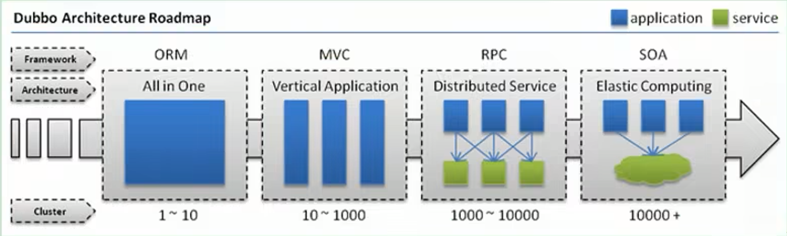


**ORM：单一应用架构**

当网站流量很小时，只需一个应用，将所有功能都部署在一起，以减少部署节点和成本。此时，用于简化增删改查工作量的数据访问框架(ORM)是关键。

**缺点**：

1. 性能扩展麻烦：所有应用部署在一起，如果想修改/扩展某一个功能，需要重新打包、部署
2. 协同开发麻烦：大家都去修改同一个应用，就有可能混乱，出错
3. 不利于升级维护

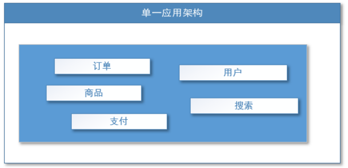

**MVC：垂直应用架构**

当访问量逐渐增大，单一应用增加机器带来的加速度越来越小，==将应用拆成互不相干的几个应用==，以提升效率。每一个页面都包括完整的流程：页面、业务逻辑、数据库

**优点**：通过切分业务来实现各个模块独立部署，降低了维护和部署的难度，团队各司其职更易管理，性能扩展也更方便，更有针对性。

**缺点**： 由于每一个应用都包含页面+业务逻辑+数据库，但是页面如果是经常改动，还需要将整个应用重新打包、部署。页面和业务逻辑无法真正的分离开来。

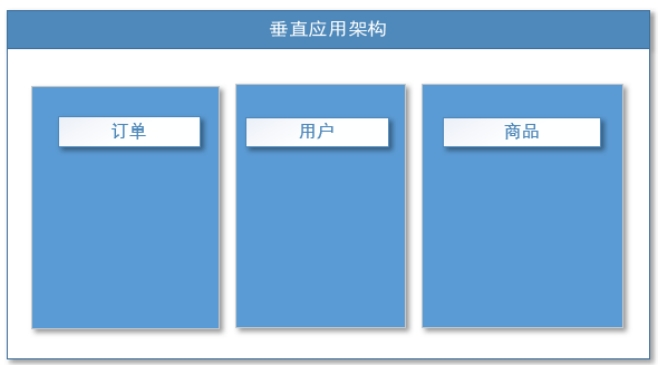 


**RPC: 分布式服务架构**

当垂直应用越来越多，应用之间交互不可避免，将核心业务抽取出来，作为独立的服务，逐渐形成稳定的服务中心，使前端应用能更快速的响应多变的市场需求。此时，用于提高业务复用及整合的**分布式服务框架(RPC)**是关键。

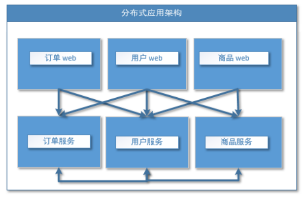

**SOA：流动计算架构**

当服务越来越多，容量的评估，小服务资源的浪费等问题逐渐显现，此时需增加一个调度中心基于访问压力实时管理集群容量，提高集群利用率。此时，用于**提高机器利用率的资源调度和治理中心(SOA)[ Service Oriented Architecture]是关键**。

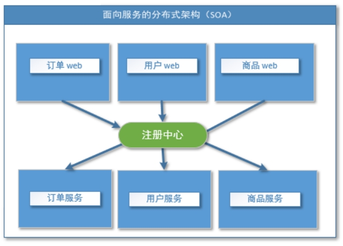


### 1.3 RPC

> 什么是 RPC ？

RPC【Remote Procedure Call】是指==远程过程调用，是一种进程间通信方式==，他是一种技术的思想，而不是规范。它允许程序调用另一个地址空间（通常是共享网络的另一台机器上）的过程或函数，而不用程序员显式编码这个远程调用的细节。即程序员无论是调用本地的还是远程的函数，本质上编写的调用代码基本相同。

**远程调用的流程**：

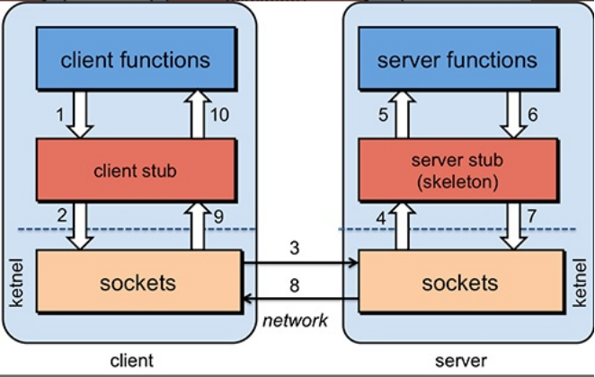

1. Client 调用 Server 中的方法
2. 通过 Client Stub【客户端存根】 对 Client 端中调用的信息进行序列化
3. 客户端通过 Sockets 网络连接将序列化的信息传递给 Server 端
4. Server 端通过网络连接获取信息，保存到 Server Stub【服务端存根】
5.  Server Stub 将消息反序列化并调用本地方法。
6. 服务端执行完本地方法，将结果返回给客户端。返回的过程依然是：序列化 —— 通过 sockets传输 —— 反序列化

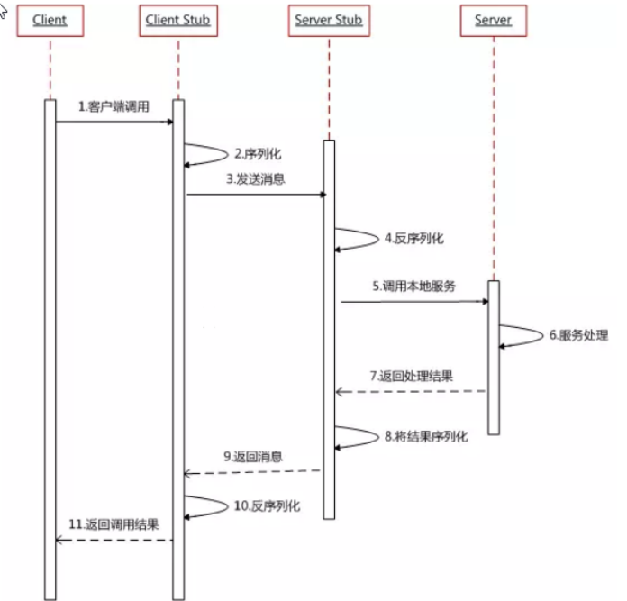

RPC两个核心模块：通讯，序列化。

常见的 RPC 框架：Dubbo、gRPC、Thrift、HSF

# 二、Dubbo

## 1、Dubbo简介


### 1.1 Dubbo 介绍

Apache Dubbo 是一款 RPC 服务开发框架，用于==解决微服务架构下的服务治理与通信问题==

官方地址：[Dubbo 介绍 | Apache Dubbo](https://cn.dubbo.apache.org/zh-cn/overview/what/)


**Dubbo 与 SpringCloud 对比**：

[与 gRPC、Spring Cloud、Istio 的关系 | Apache Dubbo](https://cn.dubbo.apache.org/zh-cn/overview/what/xyz-difference/)


### 1.2 Dubbo核心概念

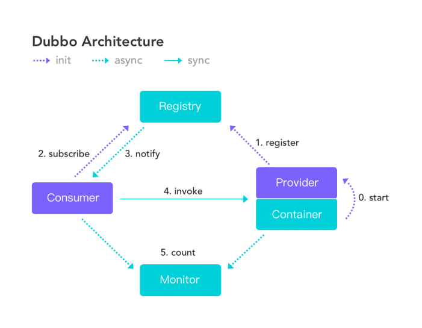

**服务提供者（Provider）**：暴露服务的服务提供方，服务提供者在启动时，向注册中心注册自己提供的服务。

**服务消费者（Consumer）**: 调用远程服务的服务消费方，服务消费者在启动时，向注册中心订阅自己所需的服务，服务消费者，从提供者地址列表中，基于软负载均衡算法，选一台提供者进行调用，如果调用失败，再选另一台调用。

**注册中心（Registry****）**：注册中心返回服务提供者地址列表给消费者，如果有变更，注册中心将基于长连接推送变更数据给消费者

**监控中心（Monitor）**：服务消费者和提供者，在内存中累计调用次数和调用时间，定时每分钟发送一次统计数据到监控中心


## 2、 Dubbo 环境搭建

### 2.1 Windows 安装 Zookeeper

官方支持多种注册中心，这里以 Zookeeper 为例。Zookeeper官方地址：[Apache ZooKeeper](https://zookeeper.apache.org/)

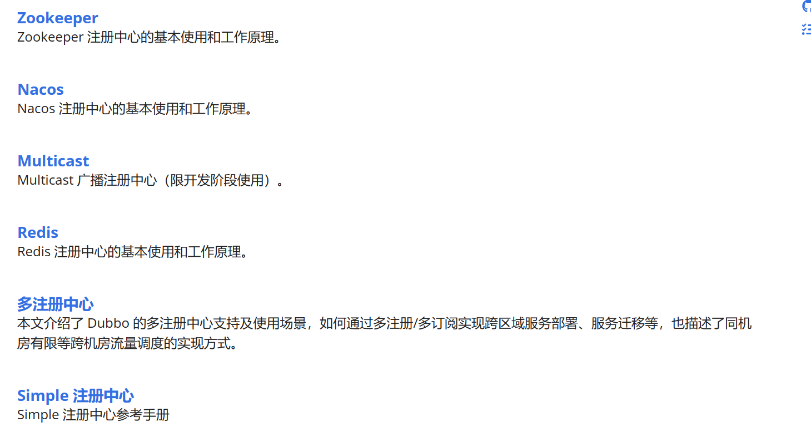


1、下载zookeeper网址 [Index of /dist/zookeeper/zookeeper-3.8.0 (apache.org)](https://archive.apache.org/dist/zookeeper/zookeeper-3.8.0/)

> PS : **我使用的是 3.8.0 版本**
>
> 下载 bin.tar.gz 包，tar.gz 是没有编译过的

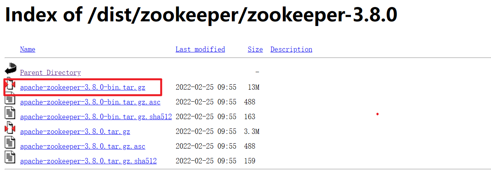

2、解压，进入 conf 目录，将 `zoo_sample_cfg` 复制一份，并改名为：`zoo.cfg` ，Zookeeper 默认加载的是 `zoo.cfg` 配置文件

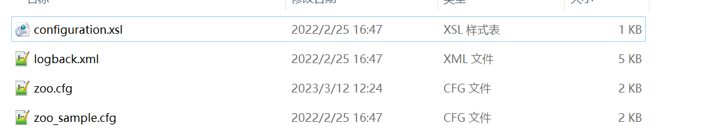

3、修改配置文件，主要修改以下三处：

```shell
# 保存日志的位置，要确保有这个目录
dataDir=../data
# 客户端连接的端口，默认就是 2181，不用改
clientPort=2181
# Dubbo-admin 管理界面连接的端口，我改成了 2180，默认是 8080 ，防止被占用
admin.serverPort=2180
```

4、进入到 bin 目录下，打开 cmd 命令行。使用 `zkServer.cmd` 命令启动 Zookeeper

5、使用zkCli.cmd测试 ls /：列出 zookeeper 根下保存的所有节点create –e /node 123：创建一个node节点，值为123, get /node：获取/node节点的值


### 2.2 Windows 安装 Dubbo-admin 管理界面

dubbo本身并不是一个服务软件。它其实就是一个jar包能够帮你的java程序连接到zookeeper，并利用zookeeper消费、提供服务。所以你不用在Linux上启动什么dubbo服务。

但是为了让用户更好的管理监控众多的dubbo服务，官方提供了一个可视化的监控程序，不过这个监控即使不装也不影响使用。并且管理界面是一个前后端分离的。

> 在安装管理界面前，保证 Zookeeper 正常启动。

1、下载 admin-server ：[apache/dubbo-admin at master (github.com)](https://github.com/apache/dubbo-admin/tree/master)

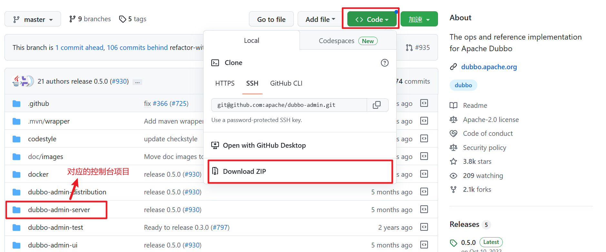


2、解压后，进入 `dubbo-admin-master\dubbo-admin-server\src\main\resources` 目录下，修改 `application.properties` 配置文件修改 Zookeeper 注册地址

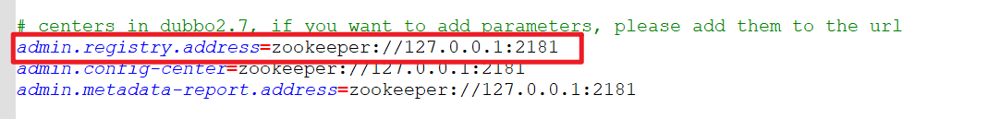

默认端口是 8080，可以使用 `server.port=7001` 修改端口号，避免冲突。

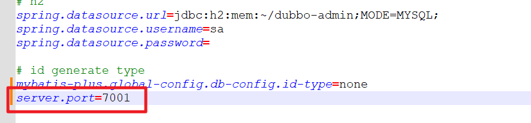

3、进入到 dubbo-admin-server 目录，打开 cmd 命令行，执行打包命令

```shell
# skip 跳过测试
mvn clean install -Dmaven.test.skip=true
```


4、使用 `java -jar` 命令启动生成的 jar 包。

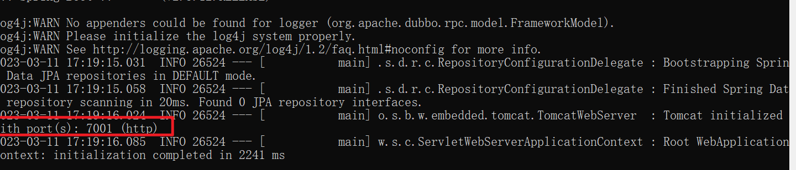


5、由于我们自定了端口号，就需要在前端中也要修改，修改`dubbo-admin-master\dubbo-admin-ui\vue.config.js`

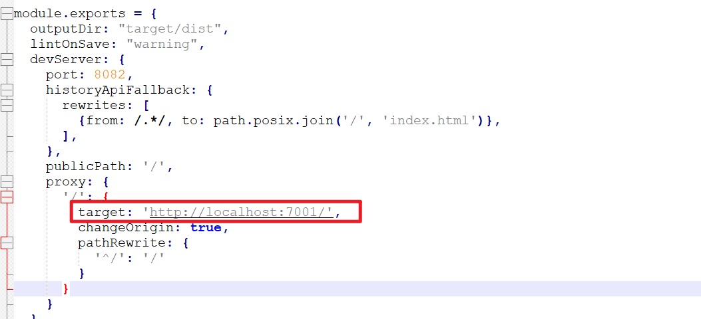


6、在 `dubbo-admin-master` 打开 cmd 命令行，安装依赖、启动项目

```shell
npm install 
npm run dev
```

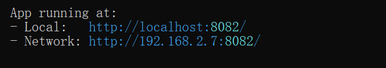

启动成功，访问本地 8082 端口，默认账号密码都是 root

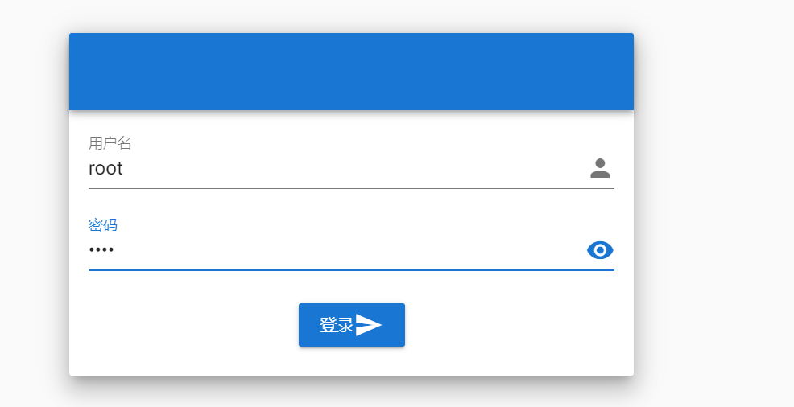

账号密码可以再 `application.properties` 中配置

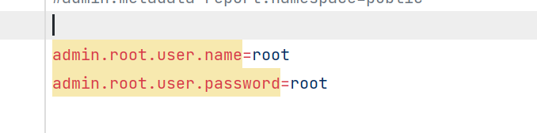


## 3、Dubbo简单案例

> dubbo所有配置项信息：[配置项参考手册 | Apache Dubbo](https://cn.dubbo.apache.org/zh-cn/overview/mannual/java-sdk/reference-manual/config/properties/#provider)
>
> dubbo所有注解信息：[Annotation 配置 | Apache Dubbo](https://cn.dubbo.apache.org/zh-cn/overview/mannual/java-sdk/reference-manual/config/annotation/)

### 3.1 基于 Spring 整合 Dubbo

#### 搭建环境

**整体架构**：

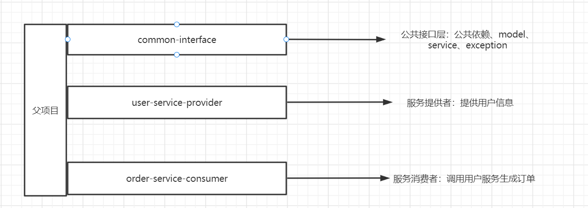

**搭建项目初始环境**：

**创建父项目** ： 删除src文件夹，只留 pom 文件

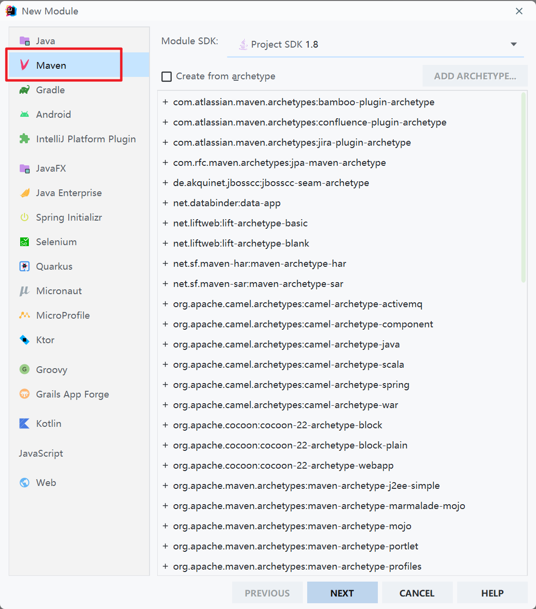

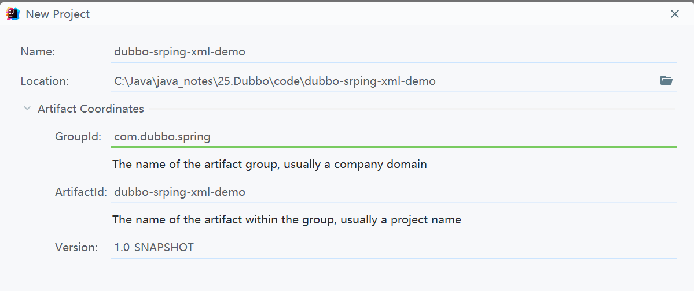

创建` common-interface` 公共模块

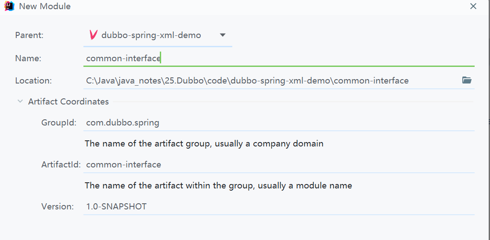


创建` user-service-provider` 模块

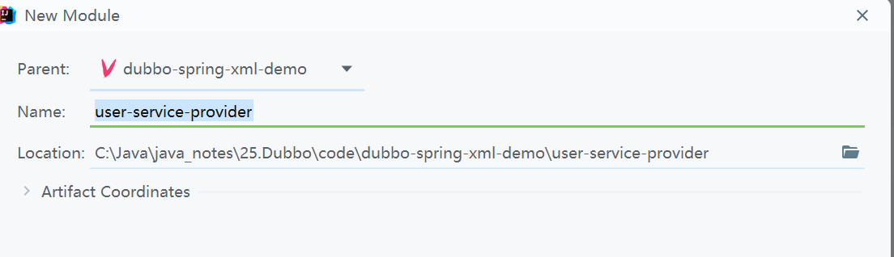


创建 `order-service-consumer` 模块

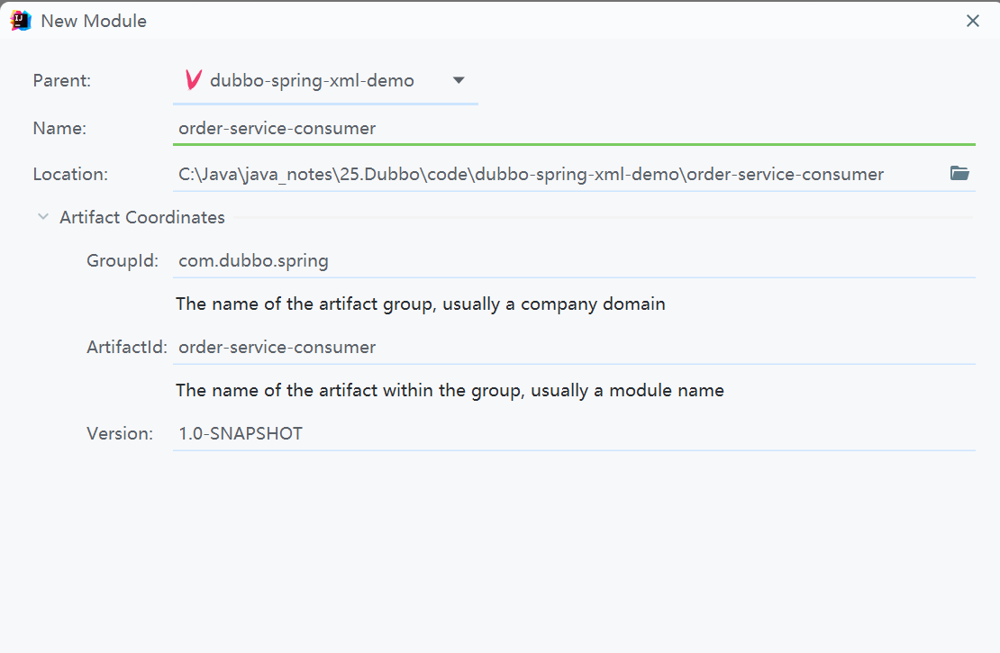

**项目整体结构**：

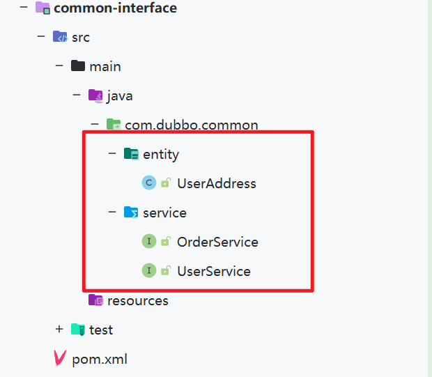

UserAddress

```java
public class UserAddress implements Serializable{


        private Integer id;
        private String userAddress; //用户地址
        private String userId; //用户id
        private String consignee; //收货人
        private String phoneNum; //电话号码
        private String isDefault; //是否为默认地址    Y-是     N-否

        public UserAddress() {
            super();
            // TODO Auto-generated constructor stub
        }

        public UserAddress(Integer id, String userAddress, String userId, String consignee, String phoneNum,
                           String isDefault) {
            super();
            this.id = id;
            this.userAddress = userAddress;
            this.userId = userId;
            this.consignee = consignee;
            this.phoneNum = phoneNum;
            this.isDefault = isDefault;
        }

        public Integer getId() {
            return id;
        }
        public void setId(Integer id) {
            this.id = id;
        }
        public String getUserAddress() {
            return userAddress;
        }
        public void setUserAddress(String userAddress) {
            this.userAddress = userAddress;
        }
        public String getUserId() {
            return userId;
        }
        public void setUserId(String userId) {
            this.userId = userId;
        }
        public String getConsignee() {
            return consignee;
        }
        public void setConsignee(String consignee) {
            this.consignee = consignee;
        }
        public String getPhoneNum() {
            return phoneNum;
        }
        public void setPhoneNum(String phoneNum) {
            this.phoneNum = phoneNum;
        }
        public String getIsDefault() {
            return isDefault;
        }
        public void setIsDefault(String isDefault) {
            this.isDefault = isDefault;
    }
}

```


OrderService

```java
/**
 * 订单服务
 * @author YZG
 *
 */
public interface OrderService {
	
	/**
	 * 初始化订单
	 * @param userId
	 */
	public List<UserAddress> initOrder(String userId);

}
```

UserService

```java
/**
 * 用户服务
 * @author YZG
 *
 */
public interface UserService {
	
	/**
	 * 按照用户id返回所有的收货地址
	 * @param userId
	 * @return
	 */
	public List<UserAddress> getUserAddressList(String userId);

}
```


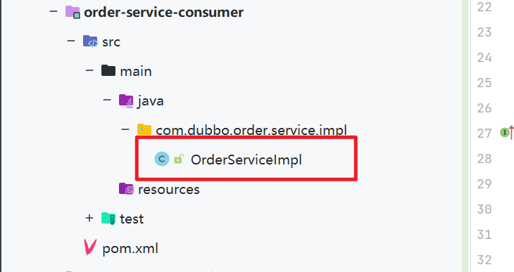

OrderServiceImpl

```java
@Service
public class OrderServiceImpl implements OrderService {


	@Autowired
	UserService userService;

	@Override
	public List<UserAddress> initOrder(String userId) {
		System.out.println("用户id："+userId);
		//1、查询用户的收货地址
		List<UserAddress> addressList = userService.getUserAddressList(userId);
		for (UserAddress userAddress : addressList) {
			System.out.println(userAddress.getUserAddress());
		}
		return addressList;
	}
}
```

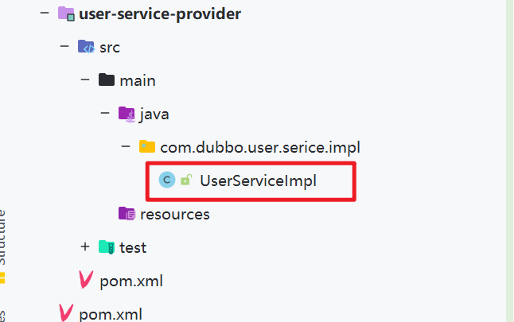

UserServiceImpl

```java
/**
 *
 * Author: YZG
 * Date: 2023/3/12 10:56
 * Description: 
 */
public class UserServiceImpl implements UserService {

    @Override
    public List<UserAddress> getUserAddressList(String userId) {
        System.out.println("UserServiceImpl.....old...");
        // TODO Auto-generated method stub
        UserAddress address1 = new UserAddress(1, "北京市昌平区宏福科技园综合楼3层", "1", "李老师", "010-56253825", "Y");
        UserAddress address2 = new UserAddress(2, "深圳市宝安区西部硅谷大厦B座3层（深圳分校）", "1", "王老师", "010-56253825", "N");
		/*try {
			Thread.sleep(4000);
		} catch (InterruptedException e) {
			// TODO Auto-generated catch block
			e.printStackTrace();
		}*/
        return Arrays.asList(address1,address2);
    }
}

```


在 user 和 order模块中，都引入 common模块依赖：

```xml
    <dependencies>
        <!--引入公共依赖-->
        <dependency>
            <groupId>com.dubbo.spring</groupId>
            <artifactId>common-interface</artifactId>
            <version>1.0-SNAPSHOT</version>
        </dependency>
    </dependencies>
```


------

#### 整合 dubbo

以上，基础环境搭建成功，但是我们需要在 order 中调用 user 服务，一种是引入jar包的方式，但是这不符合我们分布式的规范，有可能俩个服务不在一个服务器上，第二种方式：==使用Dubbo进行远程服务调用==

**整合 Dubbo 流程**：


**1、将服务提供者 provider 注册到注册中心**

**（1）引入 Dubbo 依赖**

父项目依赖：对模块中的依赖统一管理

```xml
    <dependencyManagement>
        <dependencies>
            <dependency>
                <groupId>org.apache.dubbo</groupId>
                <artifactId>dubbo</artifactId>
                <version>3.1.6</version>
            </dependency>

            <dependency>
                <groupId>org.springframework</groupId>
                <artifactId>spring-context</artifactId>
                <version>5.3.25</version>
            </dependency>

            <dependency>
                <groupId>org.apache.curator</groupId>
                <artifactId>curator-x-discovery</artifactId>
                <version>5.2.0</version>
            </dependency>
            <dependency>
                <groupId>org.apache.zookeeper</groupId>
                <artifactId>zookeeper</artifactId>
                <version>3.8.0</version>
            </dependency>
        </dependencies>
    </dependencyManagement>
```


**（2）order、user 模块依赖**

```xml
 <dependencies>
        <!--引入公共依赖-->
        <dependency>
            <groupId>com.dubbo.spring</groupId>
            <artifactId>common-interface</artifactId>
            <version>1.0-SNAPSHOT</version>
        </dependency>

        <!--dubbo 依赖-->
        <dependency>
            <groupId>org.apache.dubbo</groupId>
            <artifactId>dubbo</artifactId>
        </dependency>

        <!--spring核心依赖-->
        <dependency>
            <groupId>org.springframework</groupId>
            <artifactId>spring-context</artifactId>
        </dependency>

        <!--Zookeeper以及对应的curator依赖-->
        <dependency>
            <groupId>org.apache.curator</groupId>
            <artifactId>curator-x-discovery</artifactId>
        </dependency>
        <dependency>
            <groupId>org.apache.zookeeper</groupId>
            <artifactId>zookeeper</artifactId>
        </dependency>
    </dependencies>
```


**（3）在 user 模块的 resource 目录下创建 spring-user.xml 配置文件**

```xml
<?xml version="1.0" encoding="UTF-8"?>
<beans xmlns:xsi="http://www.w3.org/2001/XMLSchema-instance"
       xmlns="http://www.springframework.org/schema/beans"
       xmlns:context="http://www.springframework.org/schema/context"
       xmlns:dubbo="http://dubbo.apache.org/schema/dubbo"
       xsi:schemaLocation="http://www.springframework.org/schema/beans
        http://www.springframework.org/schema/beans/spring-beans.xsd
        http://www.springframework.org/schema/context
        http://www.springframework.org/schema/context/spring-context.xsd http://dubbo.apache.org/schema/dubbo http://dubbo.apache.org/schema/dubbo/dubbo.xsd">

    <!-- 定义应用名 -->
    <dubbo:application name="user-service-provider"/>

    <!-- 定义注册中心地址 -->
    <dubbo:registry address="zookeeper://127.0.0.1:2181"/>

    <!-- 声明需要暴露的服务接口,引用下面的bean-->
    <dubbo:service interface="com.dubbo.common.service.UserService" ref="userService"/>

    <!-- 服务的具体实现 -->
    <bean id="userService" class="com.dubbo.user.serice.impl.UserServiceImpl"/>

    <!--声明端口，dubbo-admin默认占用的是 20880，别重复了即可-->
    <dubbo:protocol name="dubbo" port="20881" />
</beans>
```


**（4）增加主启动类测试**

```java
public class UserMainApplication {
    public static void main(String[] args) throws InterruptedException {
        // 加载 spring.xml 文件
        ClassPathXmlApplicationContext context = new ClassPathXmlApplicationContext("spring-user.xml");
        context.start();

        // 挂起主线程，防止退出
        new CountDownLatch(1).await();
    }
}
```


UserService 服务已经成功注册到 Zookeeper 中

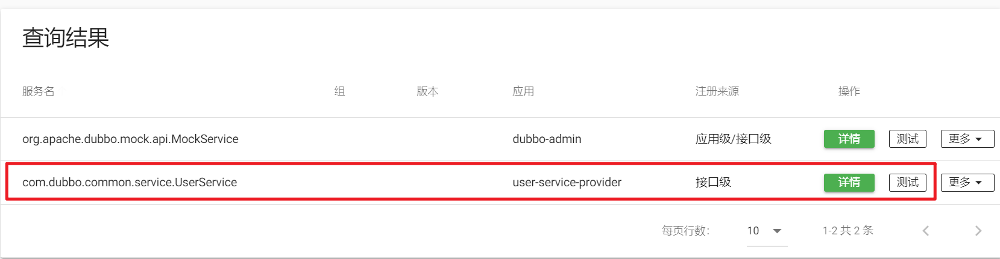


**2、让服务消费者去注册中心订阅服务提供者的服务地址**

**（1）在 Order 模块中创建 spring-order-xml 文件**

```java
<?xml version="1.0" encoding="UTF-8"?>
<beans xmlns:xsi="http://www.w3.org/2001/XMLSchema-instance"
       xmlns="http://www.springframework.org/schema/beans"
       xmlns:context="http://www.springframework.org/schema/context"
       xmlns:dubbo="http://dubbo.apache.org/schema/dubbo"
       xsi:schemaLocation="http://www.springframework.org/schema/beans
        http://www.springframework.org/schema/beans/spring-beans.xsd
        http://www.springframework.org/schema/context
        http://www.springframework.org/schema/context/spring-context.xsd http://dubbo.apache.org/schema/dubbo http://dubbo.apache.org/schema/dubbo/dubbo.xsd">

    <!--配置包扫描-->
    <context:component-scan base-package="com.dubbo" />

    <!-- 定义应用名 -->
    <dubbo:application name="order-service-consumer"/>

    <!-- 定义注册中心地址 -->
    <dubbo:registry address="zookeeper://127.0.0.1:2181"/>

    <!-- 定义订阅信息，Dubbo 会在 Spring Context 中创建对应的 bean -->
    <dubbo:reference id="userService" interface="com.dubbo.common.service.UserService"/>
</beans>
```


**（2）创建主启动类测试**

```java
public class OrderMainApplication {
    public static void main(String[] args) throws InterruptedException {
        // 加载 spring.xml 文件
        ClassPathXmlApplicationContext context = new ClassPathXmlApplicationContext("spring-order.xml");
        OrderService orderService = context.getBean(OrderService.class);
        List<UserAddress> list = orderService.initOrder("1");
        System.out.println(list);

        System.out.println("调用完成....");
        // 阻塞
        new CountDownLatch(1).await();
    }
}

```


### 3.2 基于SpringBoot 整合 Dubbo

#### 搭建环境

**1、创建父模块** ： 同样删除 src ，只留 pom 文件

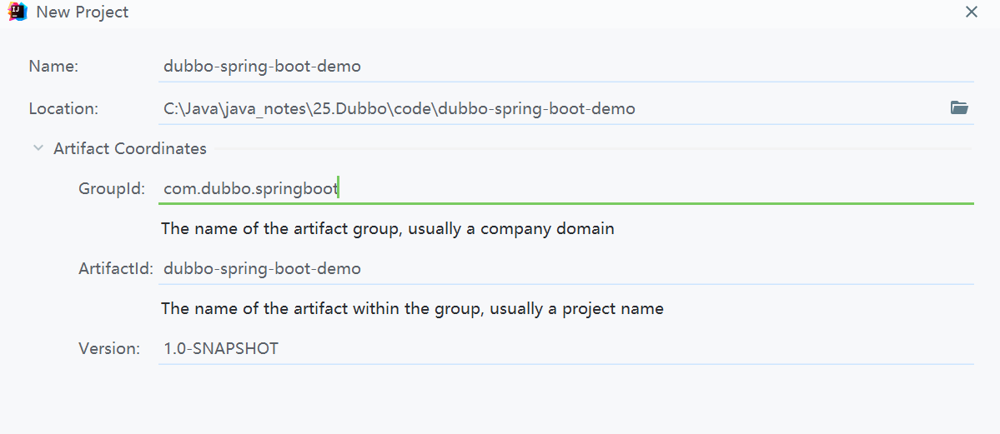

**（1）pom 文件**：

```xml
   <!--统一管理依赖-->
    <properties>
        <dubbo.version>3.2.0-beta.4</dubbo.version>
        <spring-boot.version>2.7.9</spring-boot.version>
        <maven.compiler.source>1.8</maven.compiler.source>
        <maven.compiler.target>1.8</maven.compiler.target>
        <project.build.sourceEncoding>UTF-8</project.build.sourceEncoding>
    </properties>

    <dependencyManagement>
        <dependencies>
            <!-- Spring Boot -->
            <dependency>
                <groupId>org.springframework.boot</groupId>
                <artifactId>spring-boot-dependencies</artifactId>
                <version>${spring-boot.version}</version>
                <type>pom</type>
                <scope>import</scope>
            </dependency>
            <dependency>
                <groupId>org.springframework.boot</groupId>
                <artifactId>spring-boot-starter-web</artifactId>
                <version>${spring-boot.version}</version>
            </dependency>

            <!-- Dubbo -->
            <dependency>
                <groupId>org.apache.dubbo</groupId>
                <artifactId>dubbo-bom</artifactId>
                <version>${dubbo.version}</version>
                <type>pom</type>
                <scope>import</scope>
            </dependency>

            <dependency>
                <groupId>org.apache.dubbo</groupId>
                <artifactId>dubbo-dependencies-zookeeper-curator5</artifactId>
                <version>${dubbo.version}</version>
                <type>pom</type>
            </dependency>
        </dependencies>
    </dependencyManagement>

    <build>
        <plugins>
            <plugin>
                <groupId>org.springframework.boot</groupId>
                <artifactId>spring-boot-maven-plugin</artifactId>
            </plugin>
        </plugins>
    </build>
```


**2、创建 公共模块** `springboot-common-interface`

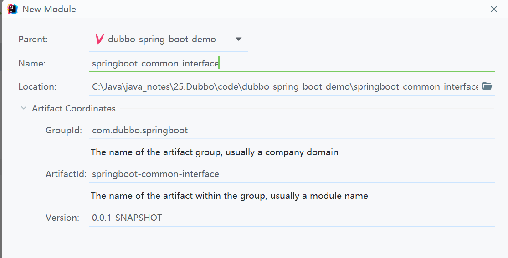


**模块结构：** 代码和 3.1 spring 整合的都一样

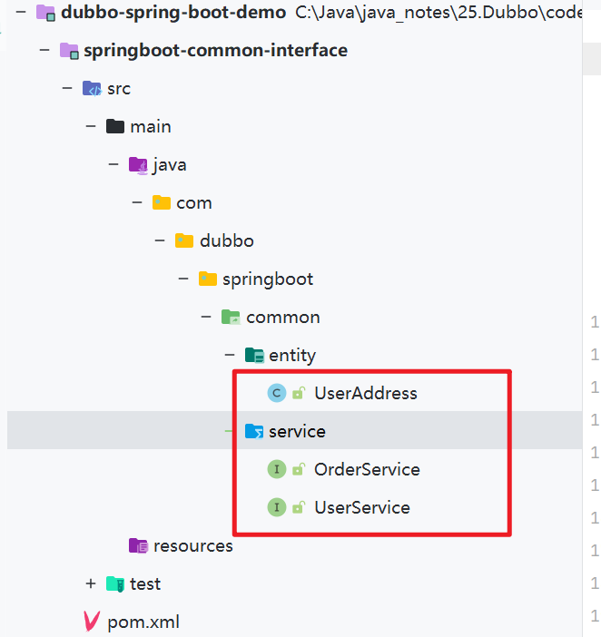

**3、创建服务提供者**：`springboot-user-service-provider` 

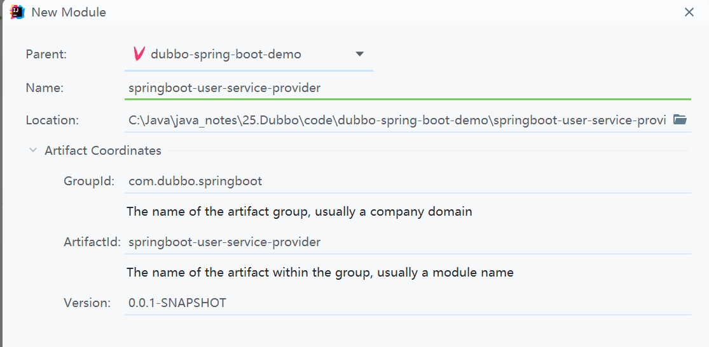

**（1）pom文件：**

```xml
    <dependencies>
        <dependency>
            <groupId>com.dubbo.springboot</groupId>
            <artifactId>springboot-common-interface</artifactId>
            <version>0.0.1-SNAPSHOT</version>
        </dependency>

        <!-- dubbo -->
        <dependency>
            <groupId>org.apache.dubbo</groupId>
            <artifactId>dubbo-spring-boot-starter</artifactId>
        </dependency>
        <!-- Zookeeper 以及 客户端 -->
        <dependency>
            <groupId>org.apache.dubbo</groupId>
            <artifactId>dubbo-dependencies-zookeeper-curator5</artifactId>
            <type>pom</type>
            <exclusions>
                <exclusion>
                    <artifactId>slf4j-reload4j</artifactId>
                    <groupId>org.slf4j</groupId>
                </exclusion>
            </exclusions>
        </dependency>

        <!-- spring boot starter -->
        <dependency>
            <groupId>org.springframework.boot</groupId>
            <artifactId>spring-boot-starter</artifactId>
        </dependency>

    </dependencies>

```


**（2）模块结构**：

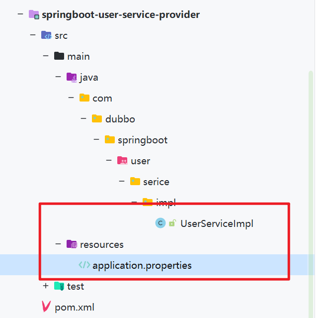

**4、创建服务消费者**：`springboot-order-service-consumer`

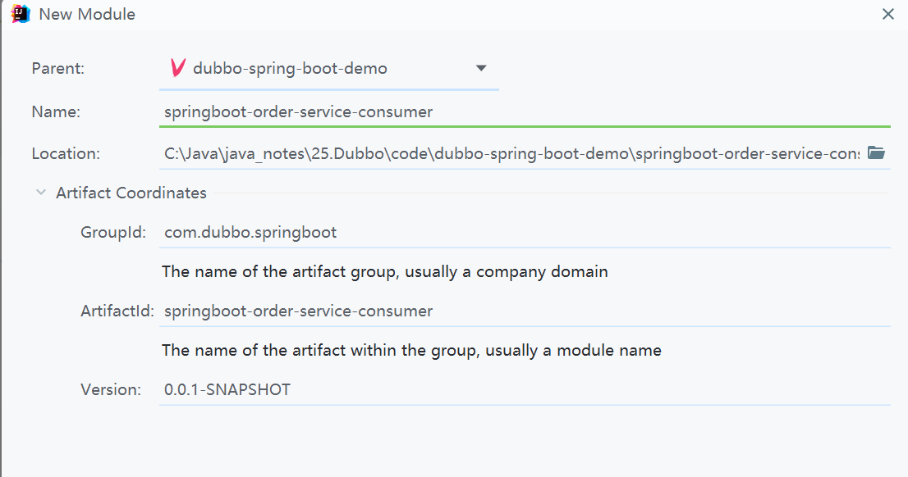

**（1）pom文件：**

```xml
    <dependencies>
        <dependency>
            <groupId>com.dubbo.springboot</groupId>
            <artifactId>springboot-common-interface</artifactId>
            <version>0.0.1-SNAPSHOT</version>
        </dependency>

        <!-- dubbo -->
        <dependency>
            <groupId>org.apache.dubbo</groupId>
            <artifactId>dubbo-spring-boot-starter</artifactId>
        </dependency>
        <dependency>
            <groupId>org.apache.dubbo</groupId>
            <artifactId>dubbo-dependencies-zookeeper-curator5</artifactId>
            <type>pom</type>
            <exclusions>
                <exclusion>
                    <artifactId>slf4j-reload4j</artifactId>
                    <groupId>org.slf4j</groupId>
                </exclusion>
            </exclusions>
        </dependency>

        <!-- spring boot starter -->
        <dependency>
            <groupId>org.springframework.boot</groupId>
            <artifactId>spring-boot-starter</artifactId>
        </dependency>
            <dependency>
                <groupId>org.springframework.boot</groupId>
                <artifactId>spring-boot-starter-web</artifactId>
            </dependency>

    </dependencies>

```


**（2）模块结构**

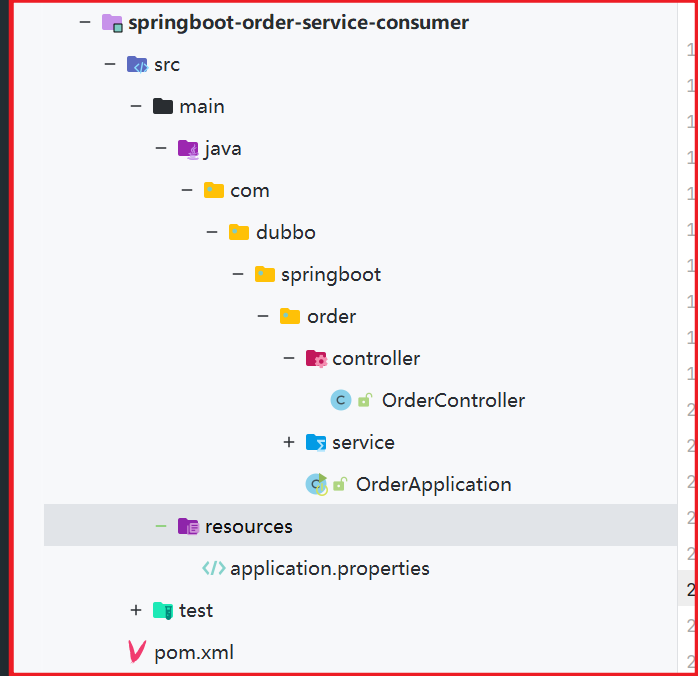

**（3）OrderController**

```java
@Controller
public class OrderController {

    @Autowired
    private OrderService orderService;

    @RequestMapping("initOrder")
    @ResponseBody
    public List<UserAddress> initOrder(String userId){
        return orderService.initOrder(userId);
    }

}
```


------

#### 整合 dubbo

以上基本环境搭建成功，下面整合 dubbo：


> `springboot-user-service-provider` 服务提供者：

1、导入依赖，在上面已经导入完成了

```xml
            <!-- Dubbo -->
            <dependency>
                <groupId>org.apache.dubbo</groupId>
                <artifactId>dubbo-bom</artifactId>
                <version>${dubbo.version}</version>
                <type>pom</type>
                <scope>import</scope>
            </dependency>

            <dependency>
                <groupId>org.apache.dubbo</groupId>
                <artifactId>dubbo-dependencies-zookeeper-curator5</artifactId>
                <version>${dubbo.version}</version>
                <type>pom</type>
            </dependency>
```


2、主启动类增加 `@EnableDubbo` 注解开启Dubbo

```java
@SpringBootApplication
@EnableDubbo // 开启Dubbo
public class UserApplication {
    public static void main(String[] args) {
        SpringApplication.run(UserApplication.class);
    }
}
```


3、在 spring 整合时，我们将所有的配置都写到了 xml 文件中，在 springboot 所有的配置都可以在 application 文件中配置

```properties
server.port=8081
# 服务名
dubbo.application.name=springboot-user-service-provider
# 注册中心地址
dubbo.registry.address=zookeeper://127.0.0.1:2181

# 端口号
dubbo.protocol.name=dubbo
# 使用 -1 会默认分配一个没有被占用的端口
dubbo.protocol.port=-1

```


4、在暴露服务时，我们使用的是 <dubbo:interface> 标签，而在 springboot中 直接在提供服务的接口上使用 `@DubboService` 注解

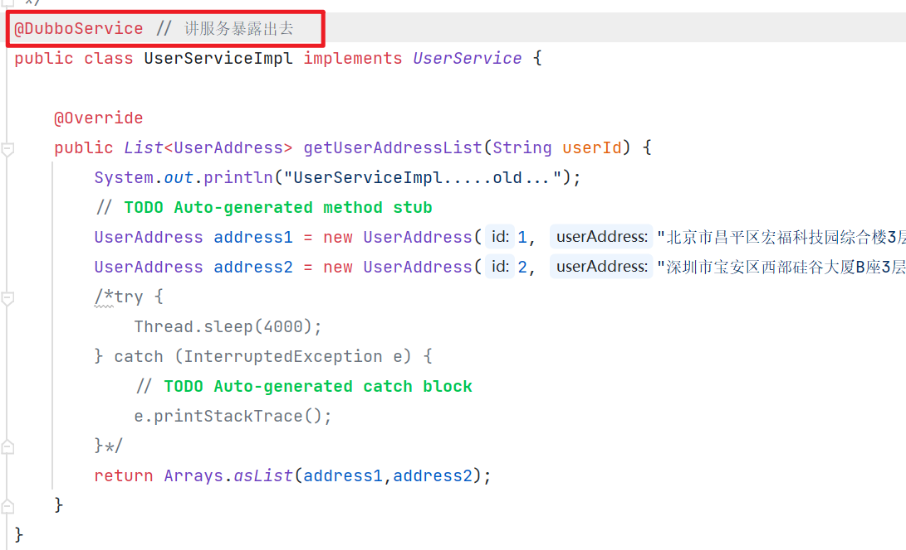


5、启动主启动类，此时 UserService 已经注册到 Zookeeper 中

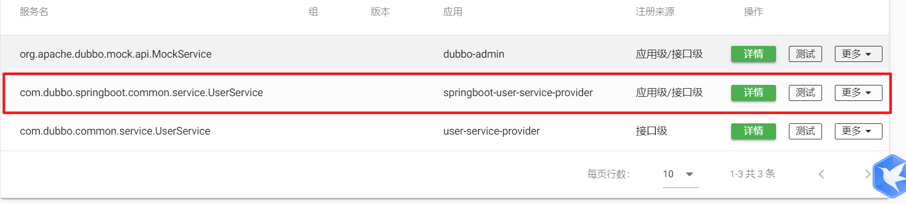


> `springboot-order-service-consumer` 消费者


1、增加依赖：以增加

2、主启动类上增加 `@EnableDubbo` 开启dubbo

3、application.properties 配置类

```properties
# 本模块的端口号
server.port=8083
# 服务名
dubbo.application.name=springboot-order-service-consumer
# 注册中心地址
dubbo.registry.address=zookeeper://127.0.0.1:2181

# 连接dubbo的端口号
dubbo.protocol.name=dubbo
# 使用 -1 会默认分配一个没有被占用的端口
dubbo.protocol.port=-1
```

4、使用 `@DubboReference` 自动注入远程服务

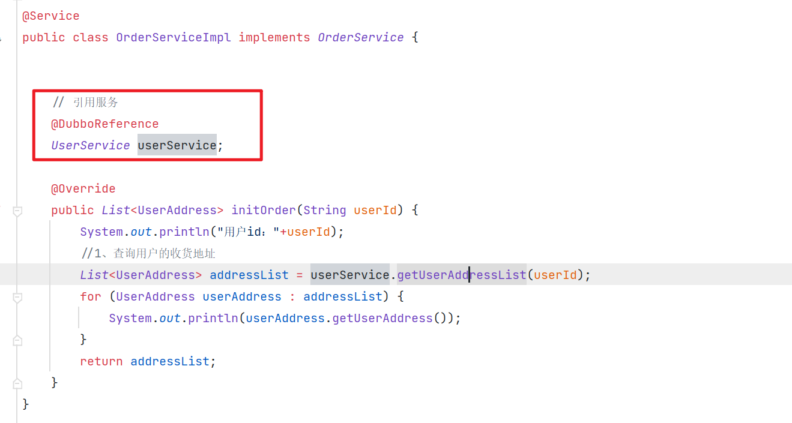


5、启动主启动类，测试

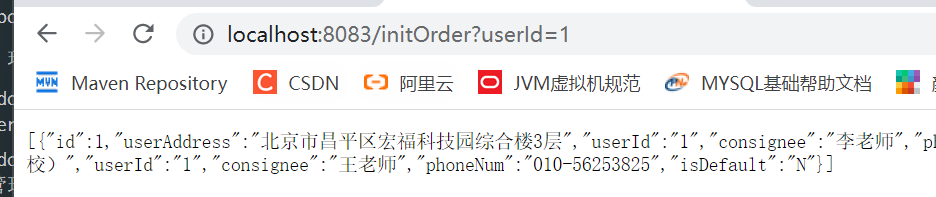


在 dubbo-admin 页面也能找到 对应的消费者：

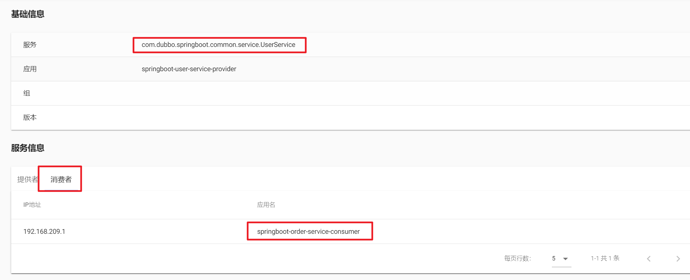


## 4、Dubbo 配置文件加载顺序

1. 加载 JVM 参数 `jvm -D 参数`，比如：`-Ddubbo.protocol.port=20881` ，在项目启动时就指定dubbo协议端口
2. 外部化配置：比如我们可以将所有的配置都放在 nacos 配置中心。
3. spring xml 文件、API、application.yaml、application.properties
4. dubbo.properties 文件

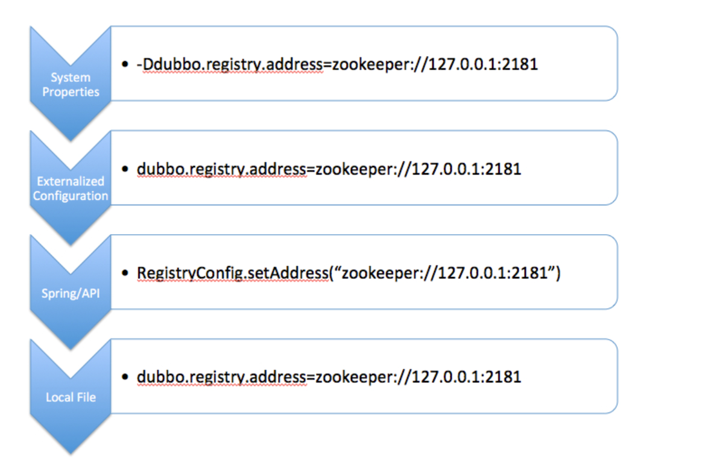

